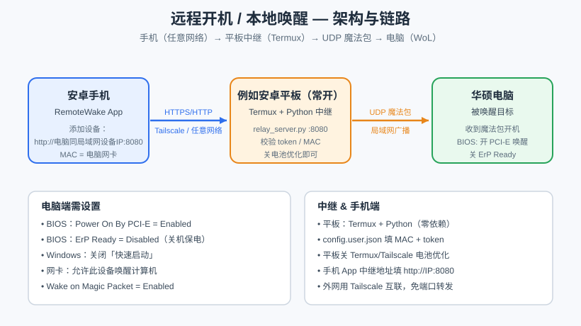

# 远程开机 / 本地唤醒（RemoteWake）

手机在**任意网络**下远程唤醒家里电脑的 Wake-on-LAN（WoL）中继方案。

- 手机 App（安卓）→ 经过 Tailscale / 任意网络 → 家里常开的安卓平板（Termux 跑 Python 中继）→ 向局域网发送 UDP 魔法包 → 华硕等支持 WoL 的电脑开机。
- 中继解决的核心问题：**UDP 广播无法跨路由器**，所以需要在「和电脑同一局域网、且能对外联网」的设备上做一跳转发。



---

## 一、下载

到 [Releases](https://github.com/lan7012/remote-wake/releases) 下载：

| 文件 | 说明 |
|------|------|
| `app-debug.apk` | 安卓手机客户端 |
| `relay-tablet-v5.zip` | 安卓平板（Termux）上的 Python 中继服务器 |

---

## 二、电脑端 BIOS 需要设置什么（以华硕主板为例）

进入 BIOS（开机按 **Del** 或 **F2** → 按 **F7** 进高级模式），路径 **Advanced → APM Configuration**：

| 选项 | 设置 | 原因 |
|------|------|------|
| **ErP** | **Disabled**（关闭） | 否则关机后主板给网卡断电，收不到魔法包 |
| **Power On By PCI-E**（或 Wake on LAN / Resume by PCI-E） | **Enabled**（开启） | 板载网卡被当作 PCI-E 设备，只有开这个关机后才保电 |

> 部分主板该项叫 `Wake on LAN (WOL)` / `Wake on PCI/PCI-E Device` / `PME Event Wake Up`，意思一致，都设为 Enabled。
> ROG / AMD 平台建议再确认：**Onboard Devices Configuration → LAN Controller = Enabled**。

**物理层验证（最准）**：电脑完全关机后，看主板网口灯——
- 灯**还亮（微弱闪烁）** → ErP 已正确关闭，可收包；
- 灯**完全熄灭** → ErP 没关干净，回 BIOS 重设。

---

## 三、Windows 需要设置什么

1. **关闭快速启动**（关键）
   - `Win + S` 搜「选择电源计划」→ 左侧「选择电源按钮的功能」→「更改当前不可用的设置」→ 取消勾选「启用快速启动」→ 保存。
   - 原因：快速启动让「关机」变成「混合休眠（S4）」，网卡不进入真正的 S5 待机态，会干扰 WoL。WoL 需要的是真·断电但网卡保电的状态。

2. **允许网卡唤醒**（若驱动提供该选项）
   - `Win + X` → 设备管理器 → 网络适配器 → 右键 **Realtek PCIe GbE Family Controller** → 属性
   - **电源管理** 标签：勾选「允许此设备唤醒计算机」
   - **高级** 标签：`Wake on Magic Packet` / `关机网络唤醒` 设为 **Enabled**
   - 注：若用 Windows 自带通用 Realtek 驱动，可能**没有**这两个选项——此时只要 BIOS 设置正确、网口灯亮，仍可被唤醒，可暂不处理驱动。

---

## 四、中继（平板）需要安装什么软件

**硬件前提**：一台安卓平板，与电脑连在**同一局域网**，并能对外联网（家里常开即可，无需一直亮屏）。

1. 安装 **Termux**（F-Droid 或官网，不要用 Play 商店的旧版）。
2. 在 Termux 里安装 Python（零额外依赖，用的都是标准库）：
   ```
   pkg update && pkg install python
   ```
3. 把 `relay-tablet-v5.zip` 传到平板并解压，例如解压到 `~/Download/relay`。
4. 创建 `config.user.json`（**不要改 config.json**，否则更新包会覆盖你的配置）：
   ```json
   {
     "token": "在这里填你自己生成的强随机token",
     "devices": { "pc1": "AA:BB:CC:DD:EE:FF" }
   }
   ```
   - token 生成示例（在电脑或平板上）：`python -c "import secrets;print(secrets.token_urlsafe(36))"`
   - MAC 用**冒号**分隔（不要用短横线 `-`）。
5. 启动中继：
   ```
   cd ~/Download/relay
   sh start_termux.sh
   ```
6. 自测链路（平板本地）：
   ```
   sh verify_termux.sh
   ```
   看到 `/status` 返回 ok、`/wake` 返回真实 MAC、广播含 `192.168.x.255` 即正常。
7. **电池优化**：设置里把 Termux（以及 Tailscale）设为「不优化 / 允许后台」，平板插电即可，无需强制唤醒锁、无需亮屏。
8. **外网互联（推荐 Tailscale）**：平板上安装 Tailscale 并登录，手机也登录同一账号。手机填中继地址时用平板的 Tailscale IP（形如 `http://100.x.x.x:8080`），免去路由器端口转发 / DDNS。仅在家用时，也可直接填平板局域网 IP。

---

## 五、手机软件需要怎么配置

1. 安装 `app-debug.apk`（安卓）。首次安装需允许「未知来源」安装。
2. 打开 App → 添加设备，填写：
   - **设备名**：如「华硕电脑」
   - **MAC 地址**：电脑网卡物理地址，冒号分隔（如 `D4:5D:64:AD:0C:6D`）
   - **中继地址**：`http://<平板的Tailscale或局域网IP>:8080`（App 会自动补全 `http://` 与 `/wake` 路径）
   - **Token**：与平板 `config.user.json` 里一致
3. 保存后在设备卡片点「远程唤醒」，结果会直接显示在卡片内（不再弹窗），方便排查。

> 常见问题：
> - 填了 `https://` 会报 TLS 错误——中继是 HTTP，请用 `http://`。
> - Android 9+ 默认禁止明文 HTTP，本 App 已开启 `usesCleartextTraffic`，正常可用。

---

## 六、目录结构

```
android/        # 手机 App 源码（Kotlin）
relay/          # 平板中继服务器（Python 标准库，零依赖）
docs/           # SETUP.md 详细指南、架构图、systemd 示例
```

## 七、许可证

[MIT](LICENSE) © 2026 Leo Lan
