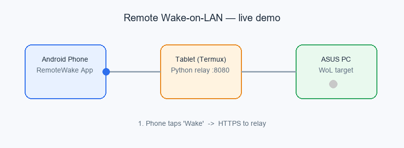

# Remote Wake / Local Wake-on-LAN (RemoteWake)

Wake your home PC from **anywhere** using your phone — a Wake-on-LAN (WoL) relay solution.

- Phone App (Android) → over Tailscale / any network → an always-on Android tablet at home running a Python relay in Termux → sends a UDP magic packet on the LAN → your WoL-capable PC (e.g. ASUS) powers on.
- Why the relay is needed: **UDP broadcast cannot cross routers**, so a device on the same LAN as the PC (and reachable from the internet) must forward the packet one hop.


---

## 1. Download

Get the binaries from [Releases](https://github.com/lan7012/remote-wake/releases):

| File | Description |
|------|-------------|
| `app-debug.apk` | Android phone client |
| `relay-tablet-v5.zip` | Python relay server for the Android tablet (Termux) |

---

## 2. What to set in the PC BIOS (ASUS example)

Enter BIOS (press **Del** or **F2** at boot → **F7** for Advanced Mode), go to **Advanced → APM Configuration**:

| Option | Setting | Why |
|--------|---------|-----|
| **ErP** | **Disabled** | Otherwise the motherboard cuts power to the NIC after shutdown and it can't receive the packet |
| **Power On By PCI-E** (a.k.a. Wake on LAN / Resume by PCI-E) | **Enabled** | The onboard NIC is treated as a PCI-E device; only with this on does it stay powered in S5 |

> Some boards label this `Wake on LAN (WOL)` / `Wake on PCI/PCI-E Device` / `PME Event Wake Up` — same meaning, set to Enabled.
> On ROG / AMD, also confirm **Onboard Devices Configuration → LAN Controller = Enabled**.

**Physical check (most reliable):** after a full shutdown, look at the motherboard NIC LED —
- LED **still lit (faint blink)** → ErP is correctly off, it can receive packets;
- LED **completely off** → ErP still cutting power, go back to BIOS.

---

## 3. What to set in Windows

1. **Turn off Fast Startup** (important)
   - `Win + S` → search "choose a power plan" → left "Choose what the power buttons do" → "Change settings that are currently unavailable" → uncheck "Turn on fast startup" → Save.
   - Why: Fast Startup makes "shutdown" a hybrid hibernate (S4); the NIC never reaches a true S5 state, which breaks WoL. WoL needs a real power-off while the NIC stays powered.

2. **Allow the NIC to wake the PC** (if the driver exposes it)
   - `Win + X` → Device Manager → Network adapters → right-click **Realtek PCIe GbE Family Controller** → Properties
   - **Power Management** tab: check "Allow this device to wake the computer"
   - **Advanced** tab: set `Wake on Magic Packet` / `Shutdown Wake-On-Lan` to **Enabled**
   - Note: the generic Windows Realtek driver may **hide** these options. If so, as long as BIOS is correct and the NIC LED stays lit, the PC can still be woken — you can skip the driver step for now.

---

## 4. What the relay (tablet) needs

**Hardware:** an Android tablet on the **same LAN as the PC** and reachable from the internet. Just keep it powered; no need to keep the screen on.

1. Install **Termux** (F-Droid or official site; avoid the outdated Play Store build).
2. Install Python in Termux (standard library only, zero extra deps):
   ```
   pkg update && pkg install python
   ```
3. Transfer `relay-tablet-v5.zip` to the tablet and unzip, e.g. to `~/Download/relay`.
4. Create `config.user.json` (**don't edit config.json**, or an update package will overwrite your settings):
   ```json
   {
     "token": "put-your-own-strong-random-token-here",
     "devices": { "pc1": "D4:5D:64:AD:0C:6D" }
   }
   ```
   - Generate a token example (on PC or tablet): `python -c "import secrets;print(secrets.token_urlsafe(36))"`
   - Use **colons** in the MAC (not hyphens `-`).
5. Start the relay:
   ```
   cd ~/Download/relay
   sh start_termux.sh
   ```
6. Self-test on the tablet:
   ```
   sh verify_termux.sh
   ```
   If `/status` returns ok, `/wake` returns the real MAC, and the broadcast list includes `192.168.x.255`, you're good.
7. **Battery optimization:** set Termux (and Tailscale) to "not optimized / allow background". Keep the tablet plugged in — no wake-lock, no need for a lit screen.
8. **Remote access (Tailscale recommended):** install Tailscale on the tablet and log in; log the phone into the same account. In the phone app use the tablet's Tailscale IP (like `http://100.x.x.x:8080`) to avoid router port-forwarding / DDNS. If you only use it at home, the tablet's LAN IP works too.

---

## 5. How to configure the phone app

1. Install `app-debug.apk` (Android). Allow "unknown sources" on first install.
2. Open the app → Add device:
   - **Name**: e.g. "Home PC"
   - **MAC address**: the PC NIC's physical address, colon-separated (e.g. `D4:5D:64:AD:0C:6D`)
   - **Relay URL**: `http://<tablet Tailscale or LAN IP>:8080` (the app auto-completes `http://` and the `/wake` path)
   - **Token**: must match the one in the tablet's `config.user.json`
3. Save, then tap "Wake" on the device card. The result shows right on the card (no popup) for easy troubleshooting.

> FAQ:
> - Using `https://` triggers a TLS error — the relay is HTTP, use `http://`.
> - Android 9+ blocks cleartext HTTP by default, but this app enables `usesCleartextTraffic`, so it works.

---

## 6. Demo



---

## 7. Project layout

```
android/        # phone app source (Kotlin)
relay/          # tablet relay server (Python stdlib, zero deps)
docs/           # SETUP.md guide, architecture diagram, systemd example
```

## 8. License

[MIT](LICENSE) © 2026 Leo Lan
